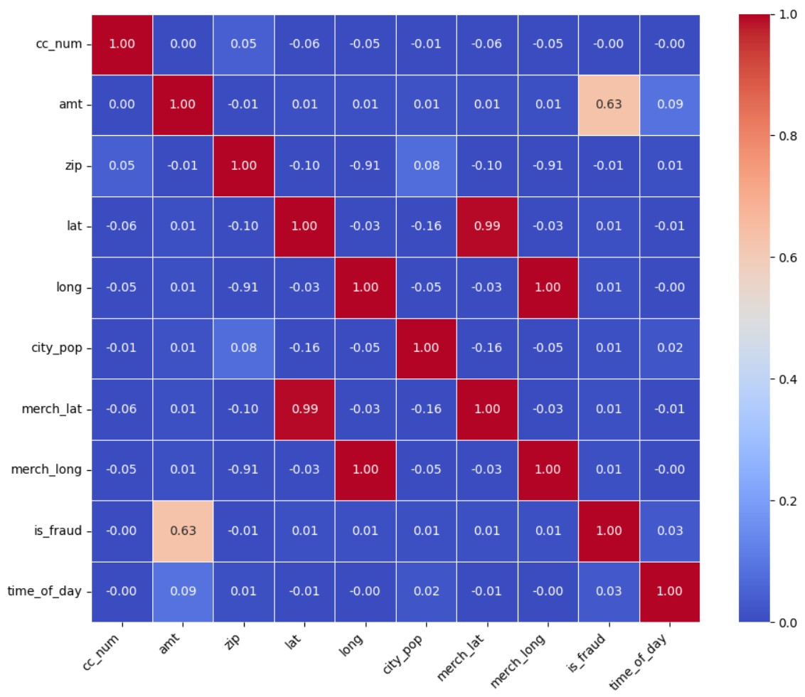

# Credit Card Fraud Detection

## Overview
This project aims to build a predictive model capable of identifying fraudulent credit card transactions with high accuracy. By leveraging the robustness of a Random Forest model, an ensemble learning method that combines multiple decision trees, the project seeks to enhance predictive accuracy and control overfitting.

## Dataset
The dataset utilised in this project comprises transactions made by credit cards, with each transaction labelled as either fraudulent or genuine. The dataset includes features such as transaction time, credit card number, merchant details, transaction amount, cardholder's demographic information, and geolocation data.

## Methodology
### 1. Data Preprocessing
- **Loading the Data**: The dataset is loaded using Pandas.
- **Exploratory Data Analysis (EDA)**: Basic statistics and visualisations are used to understand the data distribution and identify patterns.
- **Encoding Categorical Variables**: Categorical variables are converted into numerical formats using `LabelEncoder`.

### 2. Feature Engineering
- **Creating New Features**: New features are derived from existing ones to improve the model's predictive power.
- **Feature Selection**: Relevant features are selected based on their importance to the model's performance.

### 3. Model Training
- **Splitting the Data**: The dataset is split into training and testing sets.
- **Training the Model**: A Random Forest model is trained on the preprocessed data. Hyperparameters are tuned to optimise the model's performance.

### 4. Evaluation
- **Performance Metrics**: The model's performance is evaluated using accuracy.

## Findings
### Correlation Matrix
The correlation matrix below shows the relationships between different features in the dataset:

Key observations from the correlation matrix:
- The `amt` (transaction amount) has a notable correlation with `is_fraud` (fraudulent transaction).
- Other features show relatively low correlations with `is_fraud`, suggesting that fraudulent transactions are not strongly influenced by individual cardholder demographic features or location data alone.

### Model Performance
- **Accuracy**: The Random Forest model achieved an accuracy of 98.5% on the test set. This indicates the proportion of transactions correctly classified as either fraudulent or genuine.

### Hyperparameter Tuning
Hyperparameter tuning was conducted to improve the model's performance. The following hyperparameters were optimised:
- **Number of Trees in the Forest (n_estimators)**: Various values were tested to find the optimal number of trees.
- **Maximum Depth of Trees (max_depth)**: Different depths were evaluated to prevent overfitting.
- **Minimum Samples per Split (min_samples_split)**: This parameter was tuned to ensure that nodes have a minimum number of samples before splitting.

The optimal hyperparameters were found to be:
- `n_estimators`: 500
- `max_depth`: 20
- `min_samples_split`: 5
- `min_samples_leaf`: 1
- `max_features`: sqrt

Despite these efforts, the tuned model did not always perform better than the default settings. Possible reasons include:
- **Overfitting**: The model may have become too complex and started to capture noise.
- **Data Distribution**: Differences between training and test data distributions.
- **Parameter Interactions**: Complex interactions between parameters might lead to suboptimal settings.

## Requirements
- Python 3.8+
- Pandas
- NumPy
- Scikit-learn
- Matplotlib
- Seaborn

## Usage
To run the project, follow these steps:

1. Clone the repository.
2. Navigate to the project directory.
3. Ensure all required packages are installed.
4. Run the Jupyter Notebook to train and evaluate the model.
